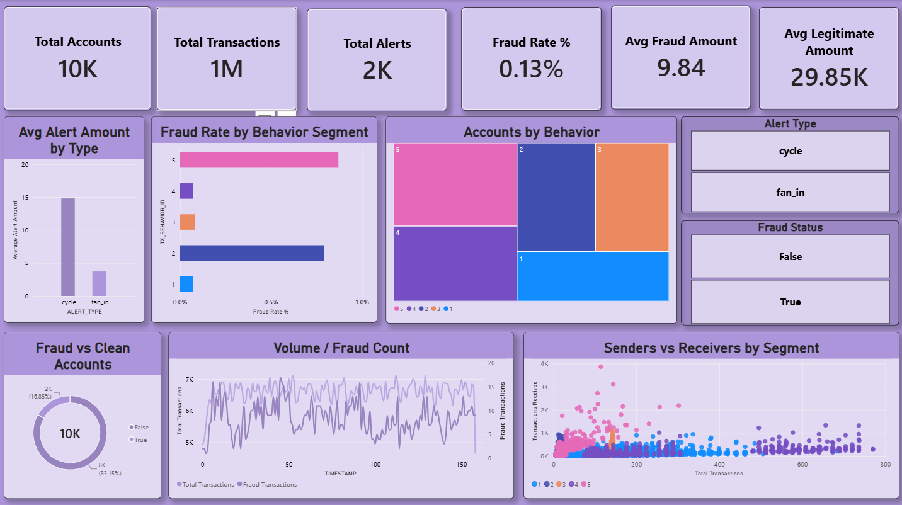

# AML Transaction Watchtower — Fraud Detection Dashboard

**Author:** Harshitha C
**Programme:** B.Com Fintech with AI, AMET University, Chennai

## Overview

AML Transaction Watchtower is a single-page Power BI dashboard built on a synthetic, IBM-style anti-money-laundering dataset. It brings together account profiles, transaction-level activity, and alert typologies into one star-schema semantic model, so that fraud patterns can be explored by volume, value, behavior segment, and sender/receiver relationships in one view.

## Dashboard Preview

## Dataset

| Table | Role | Row Count |
| --- | --- | --- |
| accounts | Dimension | 10,000 |
| transactions | Fact | 1,048,575 |
| alerts | Fact | 1,719 |
| _measures | Measures table | 29 DAX measures |

Relationships: an active sender-side link from `accounts` to `transactions`, an inactive receiver-side link activated on demand via `USERELATIONSHIP`, and a one-to-one bidirectional link between `transactions` and `alerts`.

## What the Dashboard Shows

- **KPI strip** — Total Accounts, Total Transactions, Total Alerts, Fraud Rate %, Avg Fraud Amount, and Avg Legitimate Amount at a glance.
- **Avg Alert Amount by Type** — compares the average value of `cycle` versus `fan_in` alerts.
- **Fraud Rate by Behavior Segment** — a horizontal bar chart ranking the five behavior segments by fraud rate.
- **Accounts by Behavior** — a treemap showing how the 10,000 accounts split across behavior segments.
- **Alert Type / Fraud Status slicers** — filter the whole page by alert typology or fraud flag.
- **Fraud vs Clean Accounts** — a donut split of flagged versus clean accounts.
- **Volume / Fraud Count** — a dual-axis line chart tracking total transaction volume against fraud counts across sequential time periods.
- **Senders vs Receivers by Segment** — a scatter plot positioning accounts by transactions sent versus received, colored by behavior segment.

## Key Findings

- Only **0.13%** of transactions are flagged fraudulent, yet fraud shows up as high-frequency, low-value activity — the average fraud transaction (9.84) is roughly 1/3,000th the size of the average legitimate one (29,849.79).
- **16.85%** of accounts (1,685 of 10,000) are flagged fraudulent, versus 83.15% clean.
- Behavior segments 5 and 2 stand out with visibly higher fraud rates than segments 1, 3, and 4 on the bar chart.
- `cycle` alerts carry a noticeably higher average amount than `fan_in` alerts.
- The five behavior segments are split evenly across accounts, consistent with this being a synthetically generated dataset rather than organic production data.

## Files in This Package

- `AML_Transaction_Watchtower_Analysis_Report.docx` — full written analysis of the dashboard, cross-checking each visual's on-screen values.
- `dashboard-preview.png` — screenshot of the live dashboard, embedded above.
- `README.md` — this file.

## Notes for Future Iterations

- Add the Behavior Segment slicer to the filter bar (currently only Alert Type and Fraud Status are present).
- Consider whether a dedicated Fraud Amount Share % card adds value given how small the figure is at normal display precision.
- Re-validate the transaction row count against the raw source file, since 1,048,575 rows matches the classic spreadsheet import cap.
